# project-3140_proj
Student1: Zihan Xiao 300048507 <br/>
Student2: Tong Zhao  300037013 <br/>
Student3: Wei Liu    300005620 <br/>

## Installation for Test

You will need the following technologies installed.

* PHP
* Composer
* PHPUnit

### PHP 8.0+

To run this project, you need to PHP and a command line.
This was tested on `PHP 8.1`. 
Download link: https://www.php.net/downloads.php

```bash
php --version
```

The output should show something similar to

```
PHP 8.1.3 (cli) (built: Feb 16 2022 08:20:53) (NTS Visual C++ 2019 x64)
Copyright (c) The PHP Group
Zend Engine v4.1.3, Copyright (c) Zend Technologies
```

You will also need [Composer](https://getcomposer.org/download/) and PHPUnit installed in the project.

 * First, install Composer: https://getcomposer.org/download/
    ```bash
    composer --version
    ```

    The output should show something similar to

    ```
    Composer version 2.2.7 2022-02-25 11:12:27
    ```

  * Install PHPUnit in the project using the following commands: 
    ```bash
    C:\Users\username> cd <ProjectLocalDir>\project-3140_proj

    <ProjectLocalDir>\project-3140_proj> composer require --dev phpunit/phpunit ^9.5

     ~/<ProjectLocalDir>/project-3140_proj$ ./vendor/bin/phpunit --version
    ```
    
    The output should show something similar to

    ```
    PHPUnit 9.5.0 by Sebastian Bergmann and contributors.
    ```
## Running The Tests

The tests are run using Composer and PHPUnit.

```bash
 $ ./vendor/bin/phpunit
```

The output should show something similar to

```
PHPUnit 9.5.0 by Sebastian Bergmann and contributors.

...                                                                 3 / 3 (100%)

Time: 00:00.005, Memory: 6.00 MB

OK (3 tests, 3 assertions)
```

## Launching Application: (Updated)


### Installation

You will need the following application installed:
* XAMPP (include Apache, MySQL while installing)

Here is the download link: https://www.apachefriends.org/index.html

### Setup for running the project

1. Put this folder "project-3140_proj" under xampp directory "./xampp/htdocs/" 
2. To start the server, open "XAMPP Control Panel" and click start button for "Apache" and "MySQL".
3. That will launch the application in the browser and make it available at:
    ```
    http://localhost/project-3140_proj/homePage.html
    ```
    ***Note: Recommand using Firefox as the browser to run the app.***
4. When you launch your browser, you should see the similar thing like the following screenshot (right now you can only see home page if you don't login/signup):
    

    * After login/signup, you can use our services like this:
    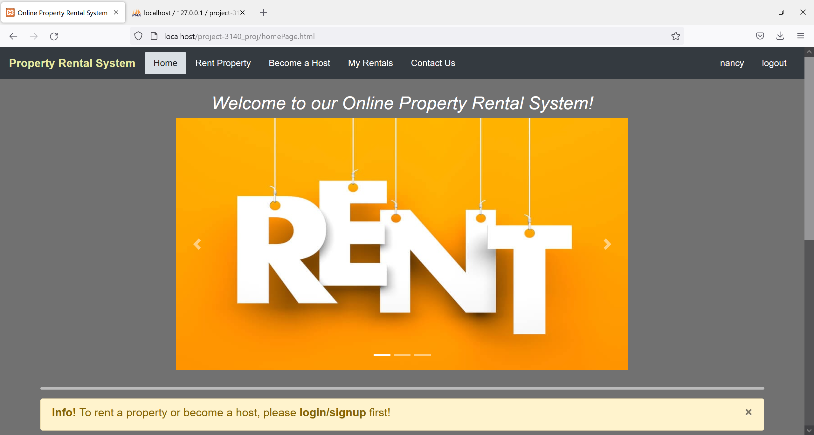
5. Sample Account for login: 
    ```
    Username: admin
    Password: admin123
    ```

### Setup for database
Based on the above instructions, you will need to:
1. Open phpMyAdmin on your localhost:
     ```
    http://localhost/phpmyadmin/
    ```
2. Database Settings:
    ```
    'DB_HOST': 'localhost'
    'DB_USER': 'root' (Default Username)
    'DB_PASSWORD': '' (No Password)
    'DB_DATABASE': 'project-3140_proj' (Create a database called "project-3140_proj")
    'DB_PORT': 3306
    ```
3. Import two SQL files into "project-3140_proj" database:
    * user.sql (https://github.com/professor-forward/project-3140_proj/blob/f/deliverable04/user.sql)
    * property.sql (https://github.com/professor-forward/project-3140_proj/blob/f/deliverable04/property.sql)
4. Then your localhost database should be like this:
  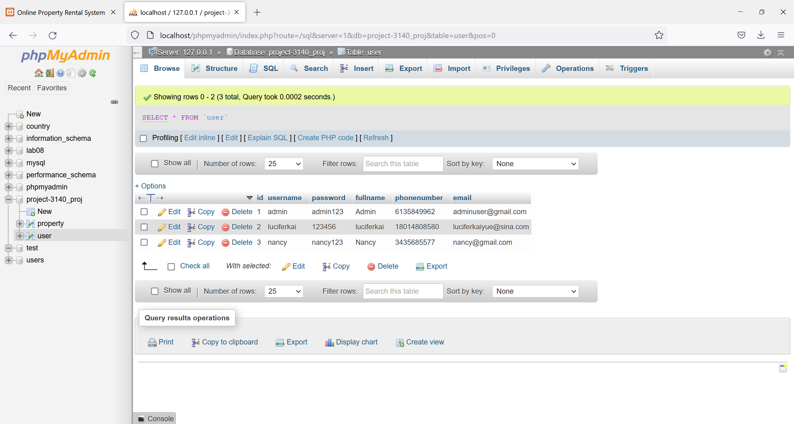
5. Initial sample data of our application:
 


## Description of Deliverable4 ##

### Grading Scheme Guide: ###
Mark | Description                                        | Guide / Where to find |
-----| -------------------------------------------------- | --------------------- |
3.0  | Implementation of features Server / Client / HTML / CSS | Please see [Implementation of features - Server / Client / HTML / CSS](#implementation-of-features) for details. |
2.0  | Software Documentation (installing, testing and developing the application | Please see [Software Documents](#installation-for-test) for details. |
1.0  | Adherance to UI Design System   |  The updates we made to our UI system can be found under [Improvements of our UI design](#improvements-of-our-ui-design)|
1.0  | Seeding application with sample data  |  You can find sample data in the screen shot under the Initial sample data of [Setup for database](#setup-for-database)|
1.0  | Screenshots of available features   | Screenshots: https://github.com/professor-forward/project-3140_proj/tree/f/deliverable04/screenshots_of_features |
1.0  | Application v1.0 (quality versus quantity)  | The formal 1.0 version of our application for this deliverable is on f/deliverable04 branch: https://github.com/professor-forward/project-3140_proj/tree/f/deliverable04 Please follow Software Documentation to install our application.|
1.0  | Git usage (commit messages, all students involved) | Please check this link: https://github.com/professor-forward/project-3140_proj/commits/f/deliverable04 |
/ 10  | 


### Implementation of features ###
In this deliverable, we implemented our web project using localhost server and database. We imporved features on server/client/html/CSS. The related commit: https://github.com/professor-forward/project-3140_proj/commits/f/deliverable04


First of all, we still use dark nav bar with white color of text. We use light grey background color. There are 4 submenus and login/signup functionality. The font family we use is: 'Source Sans Pro', sans-serif. (same for 5 main pages)

#### Implementations: ####
* ##### Implementation 1: #####
   Previously, users can reach any sub-menus they want even if they don't login/signup.This time, we disable 4 sub-menus (Rent Property/Become a Host/My Rentals/Contact Us) at the beginning when users have not logged in / signed up yet. Users can only access home page at the beginning. They need to login/signup to use our rental services.
 
 
* ##### Implementation 2: #####
  In home page, as we need to inform users to login/signup first, we add an info alert box in the middle of the home page. It can be closed by users.
 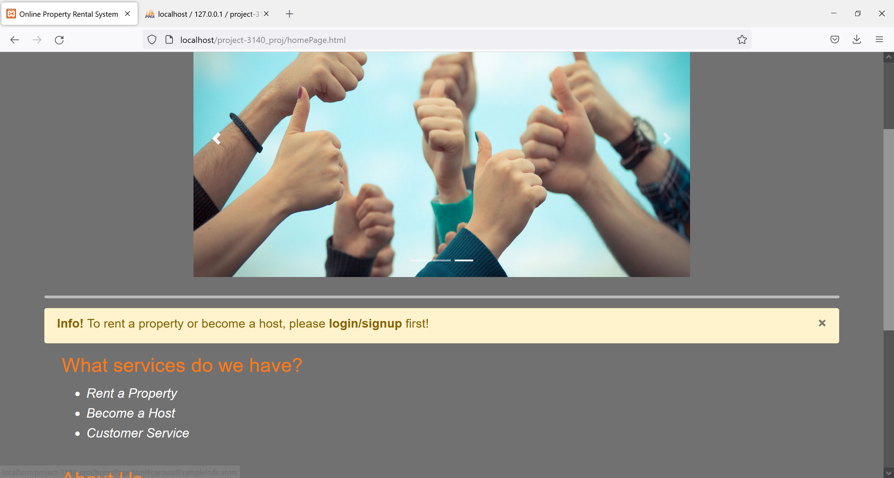
* ##### Implementation 3: #####
  In every page, we add footer and copyright at the bottom of the page, using the same theme and font.
 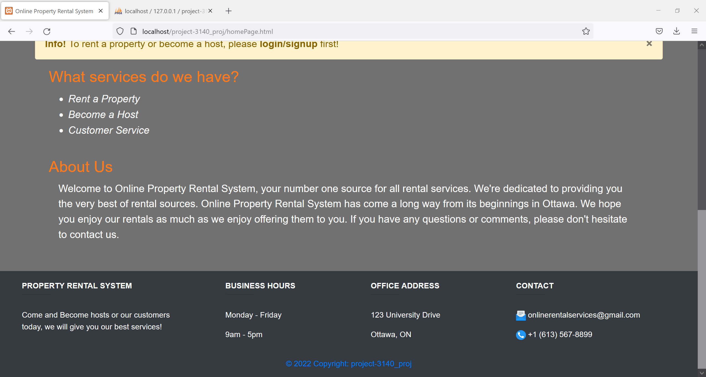
* ##### Implementation 4: #####
  Previously, we didn't fully complete the rental services on the "Rent Property" Page. This time, we add "Rent" button for each property. We also add one extra page called "My Rentals" for users to manage their rented properties. We use PHP and SQL to let these two pages talk to each other. Once user clicks rent button, it will direct user to "My Rentals" Page, which is showing which properties this user has already rented. In "My Rentals" Page, user can also click "Remove" button and easily remove the property they no longer need. "Remove" buttons are in red since this is danger to remove and it can make users think about it before clicking the button.
   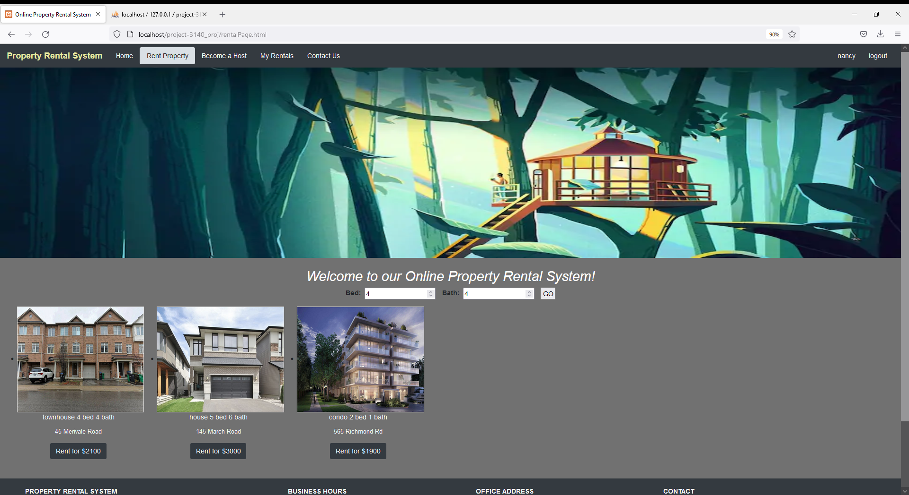
   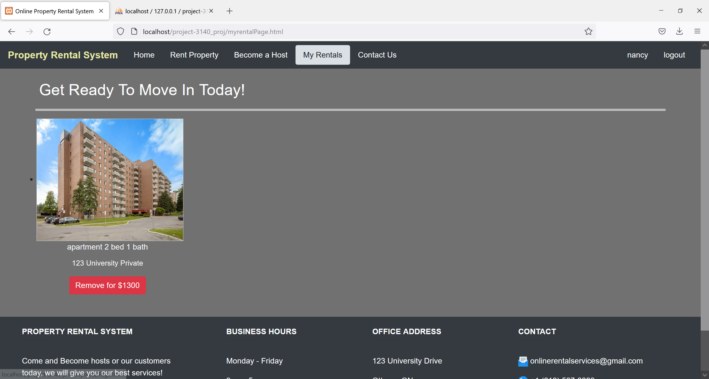
   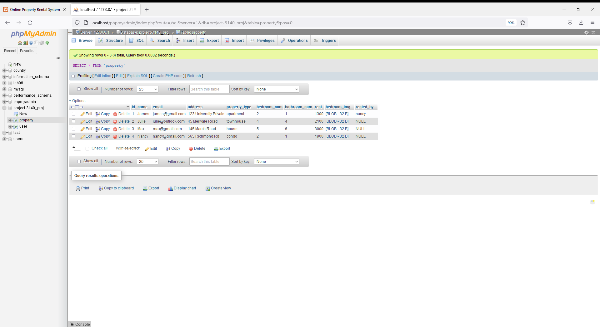
* ##### Implementation 5: #####
  Based on D3 suggestions, we refactor the CSS style and format of form in the host page. We use more of bootstrap libaries than raw CSS code. We use row and column method to split the long and complex form into two parts. In this case, it looks neat and easier to understand what to do.
 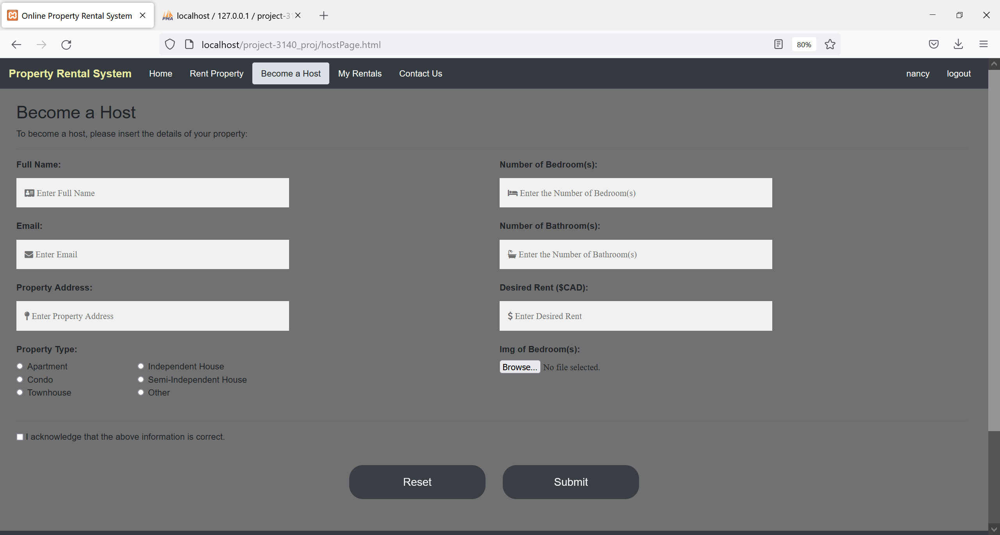

 ### Improvements of our UI design: ###
 First of all, we still use dark nav bar with white color of text. We use light grey background color. There are 4 submenus and login/signup functionality. The font family we use is: 'Source Sans Pro', sans-serif. (same for 5 main pages)

 * HomePage before login:
  
    Before login/signup, users will see our homepage before login/signup, and an info alert box will tell the users to login to use different services. We used yellow background of info alert box and bold orange text to get more attension from users to notice them the information.
  

* Login and Signup Pages:
    These pages for users to login or signup the account. We use Bootstrap popup dialog modal box with a grey submit button to make the window neater and easier to understand what they need to do. We also add a close button "x" for users to give up if they do not want to fill it anymore.
  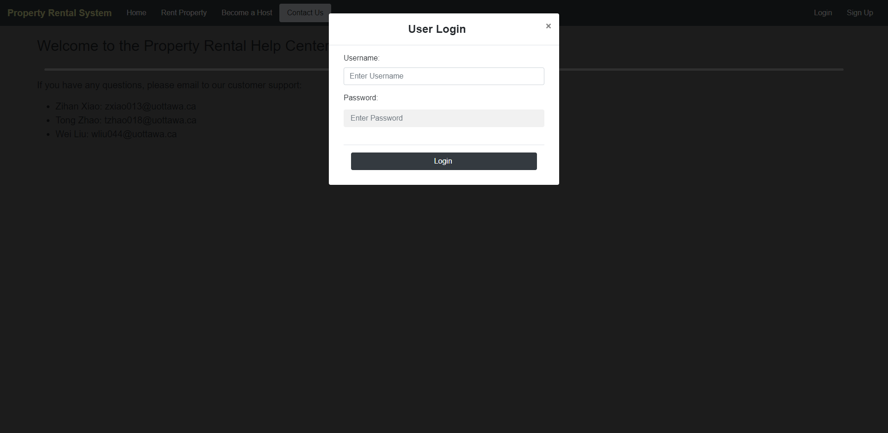
  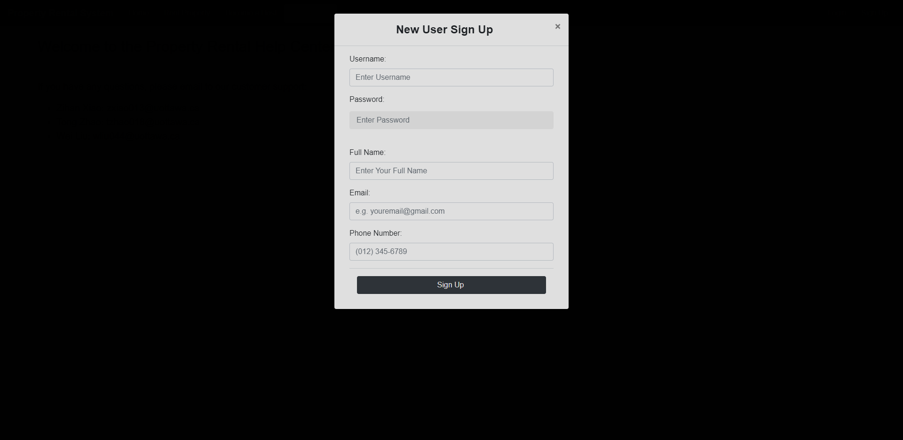

* HomePage after login/signup:

  After login/signup, users will see our homepage and be able to select features they need.
  

* Footer with Copyright:

  We added a footer with copyright which shows the business hour, office address and contact information. We used the same color of footer with navbar to make them consistent.
  

* HostPage:
  
  We refactored the CSS style and format of form in the host page. We use more of bootstrap libaries than raw CSS code. We use row and column method to split the long and complex form into two parts. In this case, it looks neat and easier to understand what to do. We also changed the color of "Reset" and "Submit" button to grey to make them more consistent.
  

* Info alert box:

  An infor alert box is added to note users to login before using our functions. We used yellow background of info alert box and bold orange text to get more attension from users to notice them the information.
  

* MyRentals Page:

  Once logged in, users will be able to see the properties they've already rented. We added "Remove" button to let users be able to remove their rentals if they no longer want to rent this property. In case, we used red color for "Remove" button since it is necessary for users to think about it carefully before they make this choice. Red color means important and danger. Once they click "Remove" button, the website will direct them to the Rental Page to choose the new properties.
  

* RentalPage:

  We updated our rental webpage to let users be able to search properties they interested in. Adding images of properties can let users easier to know how the properties look like. Once users click "Rent" button, the website will direct them to My Rentals Page.
  

* ContactPage new:

  We added a contact webpage which includes our contact information in case if users have any questions or need help.
  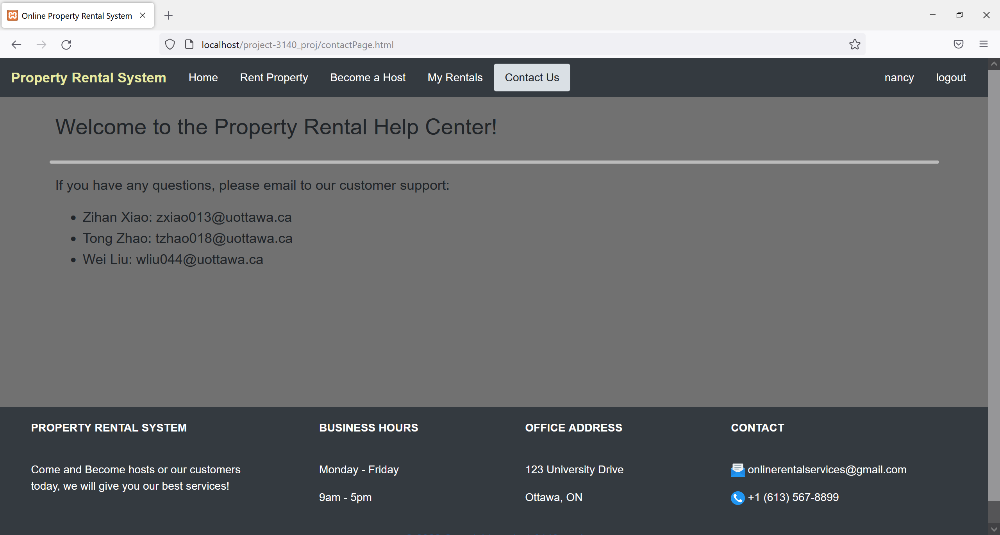


## Description of Deliverable 3 ##
In this deliverable, we created Server and Database Technology, Automated test framework, improved Front-end interactivity (Mock-ups).

### Refine UI Design System ###
We changed our raw CSS code to bootstrap and JQuery. The related file: https://github.com/professor-forward/project-3140_proj/blob/f/deliverable03/homePage.html. The related commit: https://github.com/professor-forward/project-3140_proj/pull/9.

UI Design System:
First of all, we use dark nav bar with white color of text. We use light grey background color. There are 4 submenus and login/signup functionality. The font family we use is: 'Source Sans Pro', sans-serif. (same for 4 main pages)
* Home Page: 
   In the middle of the page, we use a slide show with three pictures.
 <!--  -->
* Rental Page: 
  We have a welcome image and header located on the top of the rental page. In the middle of the page, there is a filter that can filter the property listings. Several properties are listed below for renting. The images and property information are inserted from the host page by users.
 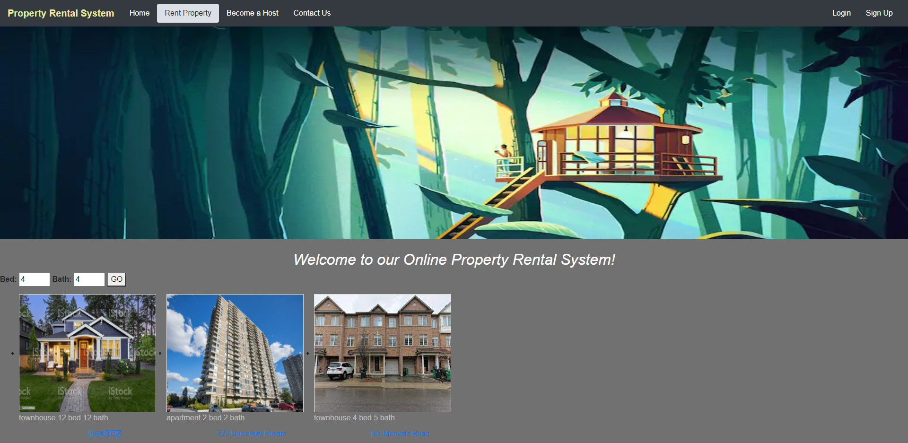
* Host Page: 
  We use the mix of text box, button, radio button, reset/submit button to display a form for users to complete. We use icons in the form for better user understanding. Submitted info will be deliverd to rental page.
 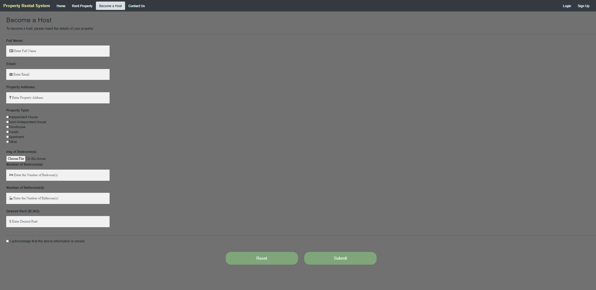
* Contact Page: 
  We use divider line to divide welcome header and contact information.
 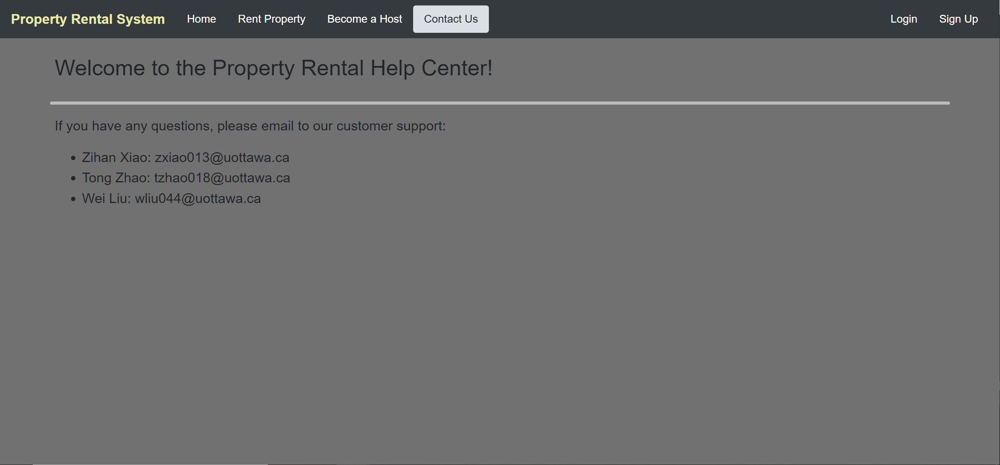
* Login Page: 
  We use the same theme (dark) of login button as nav bar. After logging in, there will be the username showing on the top left of the nav bar, and there will be an logout button next to it.
 
* Signup Page: 
  We use the same theme (dark) of signup button as nav bar. After signing up, there will be the username showing on the top left of the nav bar, and there will be an logout button next to it.
 


### Grading Scheme Guide: ###
Mark | Description                                        | Guide / Where to find |
-----| -------------------------------------------------- | --------------------- |
2.0  | Server Technology integrated (e.g. PHP, Elixir, Go) including library and frameworks | We use PHP as server side language, specifically on Login/Signup Page, Rental/Host Page, and phpMyAdmin Database Connector. The related files: https://github.com/professor-forward/project-3140_proj/tree/f/deliverable03/api (Login/Signup Page, Rental/Host); https://github.com/professor-forward/project-3140_proj/tree/f/deliverable03/inc (Database Connector). The related commit: https://github.com/professor-forward/project-3140_proj/commit/a8a63f243371440d3c5b8b377f38e7c92cb13d38|
2.0  | Database Technology integrated (e.g. MySQL, Postgres, Redis, etc) | We use MySQL to connect with phpMyAdmin. The related file: https://github.com/professor-forward/project-3140_proj/blob/f/deliverable03/house.sql |
1.0  | Automated test framework in place   | We use Selenium Automation Framework. The related files：https://github.com/professor-forward/project-3140_proj/tree/f/deliverable03/tests; The related commit: https://github.com/professor-forward/project-3140_proj/commit/127c47fe53482193865feac59c8a3266cf5d445d|
2.0  | Deployment / Upgrade Scripts working  | We wrote a few Java Scripts to implement this. The related file is: https://github.com/professor-forward/project-3140_proj/blob/f/deliverable03/js/jquery.js |
1.0  | Refined HTML/CSS + UI Design System   | Please see [Refined HTML/CSS + UI Design System](#refine-ui-design-system) for details |
1.0  | Front-end (mock) interactivity using JavaScript  | We add login and signup form validation using Javascript. The mock-ups (screenshots) location: https://github.com/professor-forward/project-3140_proj/tree/f/deliverable03/frontEnd_interactivity. The related files: https://github.com/professor-forward/project-3140_proj/blob/f/deliverable03/hostPage.js; https://github.com/professor-forward/project-3140_proj/blob/f/deliverable03/rentalPage.js; https://github.com/professor-forward/project-3140_proj/blob/f/deliverable03/homePage.js; https://github.com/professor-forward/project-3140_proj/blob/f/deliverable03/contactPage.js |
1.0  | README.md updated with installation / deployment instructions | Deployment/Instructions: Note that we have put our web project on the cloud server. You can simply run the applicatoin by clicking this website: http://101.43.108.14/homePage.html (This is our home page, you can choose the submenus from the nav bar) |
/ 10  | 


## Description of Deliverable 2
In this deliverable, we created several html/css files to do as Mock-ups, they include:
* [homePage.html](homePage.html)
* [rentalPage.html](rentalPage.html)
* [hostPage.html](hostPage.html)
* [contactPage.html](contactPage.html)
* [style.css](/style/style.css)
* [components.css](/style/components.css)
* [buttons.css](/style/buttons.css)
* [color_palette.css](/style/color_palette.css)
* [images](/images)

And all Colour Palette, Fonts and Type Scale data can be found in the style.css.

To test the functions of the project, first open homePage.html, you'll see the homepage of our website.
Then, click "rent property", you'll jump to the rentalPage.html and you can rent the property already exitsted.
Then, click "Become a host", you'll jump to the hostPage.html and you can enter the information of your property and post that on our webpage for others to rent
Then, click "Contact Us" you can see the contact information of us.
On the right side of the nav bar, we have "Login/SignUp" button, inthe future you will be able to login or create an account there, but the function hasn't been implemented yet.

### Grading Scheme Guide: ###
Mark | Description                                        | Guide / Where to find |
-----| -------------------------------------------------- | --------------------- |
3.0  | Mock-Ups in HTML / CSS                             | Please see [Description of Deliverable 2](#description-of-deliverable-2) for more details|
1.0  | Colour Palette                                     | * Source code: [style/color_palette.css](style/color_palette.css)<br>* Commit link: https://github.com/professor-forward/project-3140_proj/commit/5f313af54b86a3e3c0a0b7b1928ea7794822bc06 |
1.0  | Fonts and Type Scale                               | * Source code: [style/style.css](style/style.css)<br>* Commit link: https://github.com/professor-forward/project-3140_proj/commit/057814109996fd00212b12552978522af90a09d0 |
1.0  | Icons (and other images)                           | * Icons Commit link: https://github.com/professor-forward/project-3140_proj/commit/d1e1f7e3eb878c20f7b157600bcd25db1d270f06 <br>* Images Source code: [/images](/images)<br>* Commit link: https://github.com/professor-forward/project-3140_proj/commit/f257d8f3456a131e03cf3373838553eac11a3b54 |
1.0  | Buttons and Form Elements                          | * Source code: [style/buttons.css](style/buttons.css)<br>* Commit link: https://github.com/professor-forward/project-3140_proj/commit/a5f71901c9dc05c4d59b948ddff4d83172319d8f |
1.0  | UI Components (e.g. popups)                        |* Source code: [style/components.css](style/components.css)<br>* Commit link: https://github.com/professor-forward/project-3140_proj/commit/d1e1f7e3eb878c20f7b157600bcd25db1d270f06 |
2.0  | Updated README.md to document UI Design System     | * Commit link: https://github.com/professor-forward/project-3140_proj/commit/624dfbb58d7fa85eed2161e15266f3aecbe9baff
|1.0  | Git usage (commit messages, all students involved) | * All Commits: https://github.com/professor-forward/project-3140_proj/commits/f/deliverable02 |
/ 10  | 

## Description of Project Deliverable 1

The project we will be doing is called "Online Property Rental System"(OPRS). This project is an online application that enable users to rent their house. It contains register and login features for both "Admin" and "Users". The registration infomation will be inserted and saved into database. And the clients can log in using registerd accounts. If clients login as admin, they can add or remove properties in the list, futhermore, they can also edit properties(e.g. price, location), view the details of properties (e.g. rent, room number, etc). For users, they can rent properties, add properties, and view the details of properties (e.g. rent, room number, etc). If users want to rent a property, they will need to insert credit card information and personal information to process the rental service. Finally, both admin and users are able to log out once they are done.
